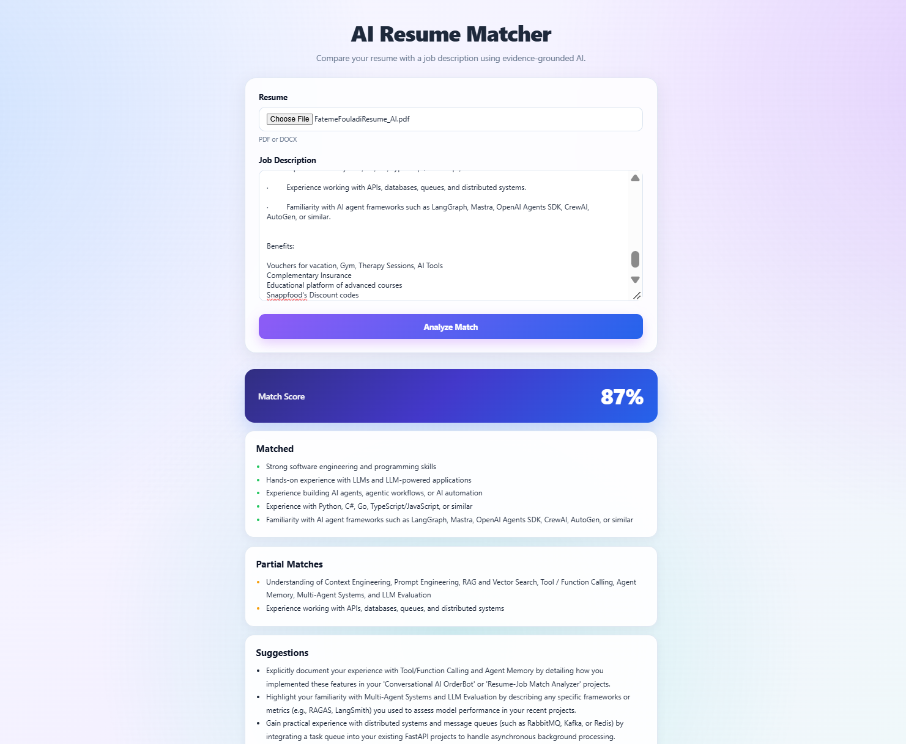
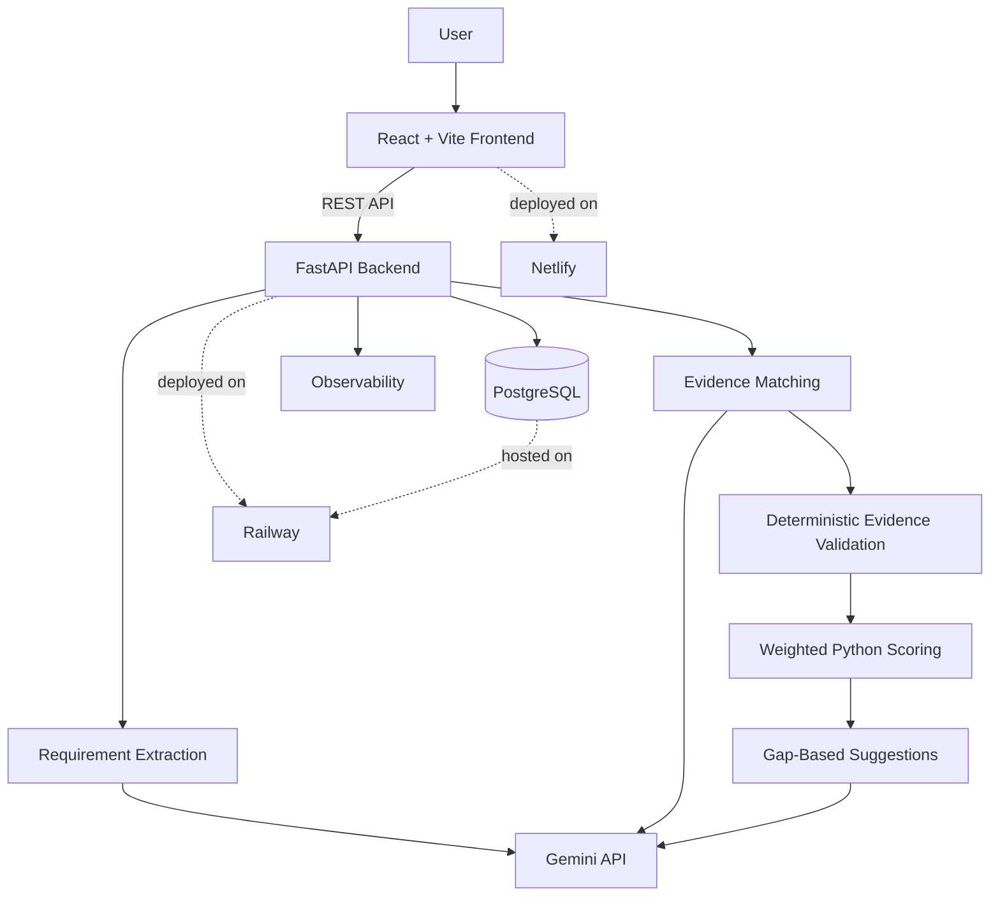

# AI Resume–Job Matcher

A production-style AI application that compares a resume with a job description and identifies:

- Matched requirements
- Partial matches
- Missing requirements
- Resume evidence for each requirement
- Overall match score
- Improvement suggestions

The system combines LLM-based semantic reasoning with deterministic validation and scoring.

## Live Demo

[Open the Live App](https://ai-resume-job-match.netlify.app/)

## Preview



## Architecture



## AI Pipeline

```text
Resume + Job Description
        ↓
Requirement Extraction
        ↓
Evidence Matching
        ↓
Evidence Validation
        ↓
Matched / Partial / Missing
        ↓
Deterministic Weighted Scoring
        ↓
Suggestions
```

The LLM handles semantic interpretation, while Python handles evidence validation and final scoring.

## Main Technologies

### Backend & AI
- Python
- FastAPI
- Google Gemini API
- Pydantic
- SQLModel / SQLAlchemy
- PostgreSQL
- Alembic

### Resume Processing
- PyPDF
- python-docx

### Testing & Evaluation
- pytest
- Structured AI evaluation
- Evidence grounding checks
- Match-status evaluation
- Latency and fallback observability

### Frontend
- React
- Vite
- CSS

### Deployment
- Docker
- Railway
- Netlify
- GitHub

## Key Engineering Features

- Structured LLM outputs
- Cross-industry requirement extraction
- Evidence-grounded matching
- Deterministic hallucination checks
- Deterministic weighted scoring
- Primary/fallback model support
- Prompt versioning
- Observability
- PostgreSQL persistence
- PDF/DOCX upload support
- REST API with Swagger
- Automated tests
- Dockerized backend
- Deployed frontend and backend

## Local Run

Backend:

```bash
docker compose up --build -d
```

Swagger:

```text
http://localhost:8000/docs
```

Frontend:

```bash
cd frontend
npm install
npm run dev
```

Frontend:

```text
http://localhost:5173
```

## Project Goal

Built as an AI Engineering portfolio project demonstrating:

```text
LLM reasoning
+ deterministic guardrails
+ evaluation
+ observability
+ API
+ database
+ testing
+ Docker
+ frontend
+ cloud deployment
```
